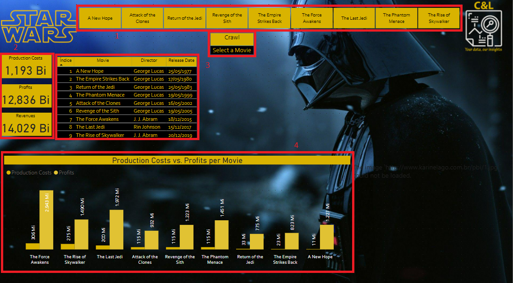
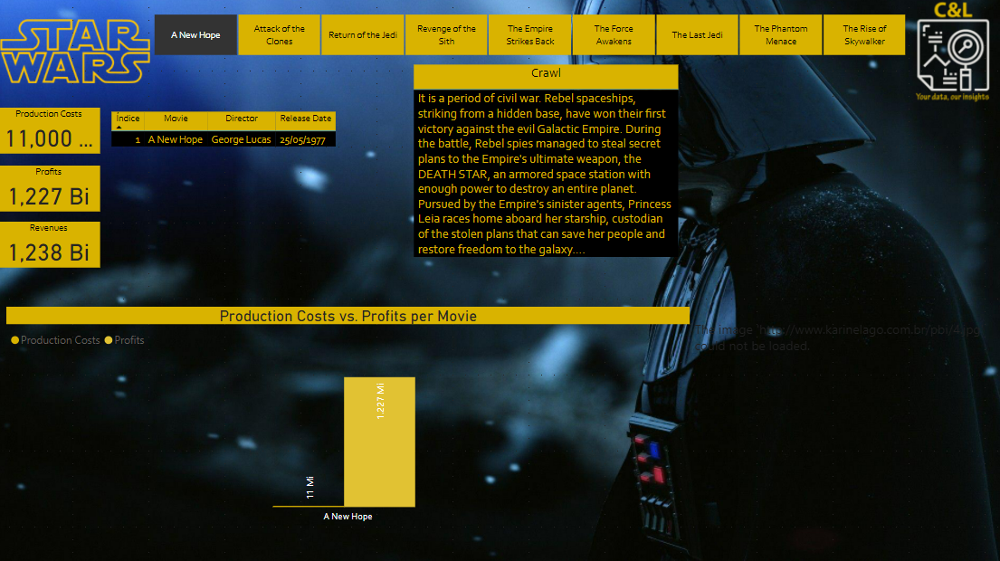

# STAR WARS

This dashboard based on the Star Wars movies was created to show a comparison between the USD values of Production Costs, Total Revenue and Total Profit involving each of the 9 movies in the series.

In addition, you can also access the movie crawl and the movie cover photo by selecting each one from the top menu.

The information in this report was extracted from [The Numbers](https://www.the-numbers.com/movies/franchise/Star-Wars#tab=summary) website, this website is specialized in providing this type of information about the Movie Business.

It is worth remembering that none of the information on this dashboard is private or confidential.

The panel was built using a data segmenter, which works as the report filter (1), we have some cards, which present data on production costs, profits and revenue (2), we have two tables that present the list of films and also the movie crawl (3) and we have a bar chart that compares the values of Production Cost and Profits per movie (4).

