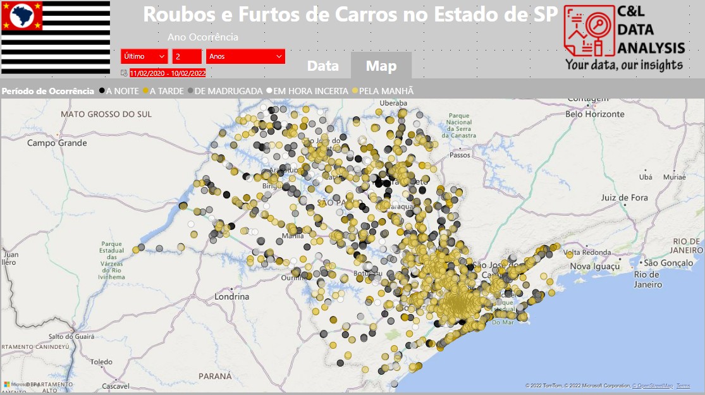
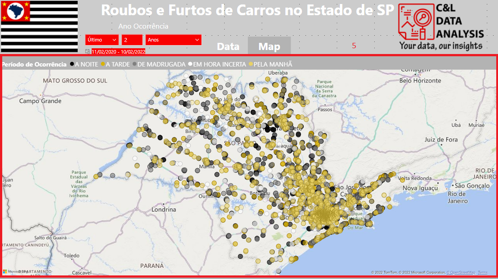

# CAR THEFT

This dashboard based on the Harry Potter movies was created to show a comparison between the values of Production Budget, Total Revenue and Total Profit, all in USD, involving each of the 8 movies in the series and also 2 movies from the Fantastic Beasts series (up to 2018).

The information in this report was extracted from [The Numbers](https://www.the-numbers.com/movies/franchise/Harry-Potter#tab=summary) website, this website is specialized in providing this type of information about the Movie Business.

It is worth remembering that none of the information on this dashboard is private or confidential.

The panel was built using some cards, which present data on production costs, profits and revenue (1) and a line and bar chart that compares the values of Budget, Revenue and Profits per movie (2).

