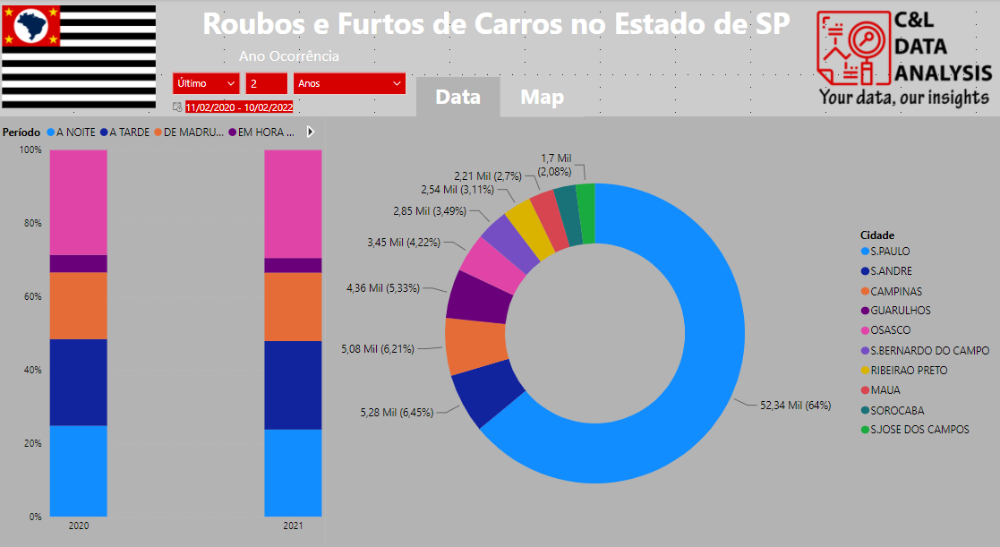
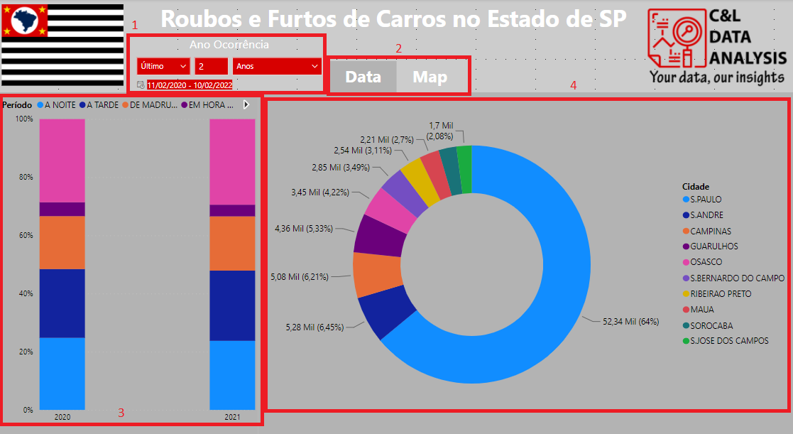

# CAR THEFT

This dashboard was created based on vehicle theft data in the state of São Paulo and its main goal is to show how this type of data can be analyzed.

The information in this report was extracted from the [Transparency Portal of the Public Security Secretariat](http://www.ssp.sp.gov.br/transparenciassp/Consulta.aspx), this portal is publicly accessible and available to all who want to access your information.

It is worth remembering that none of the information on this dashboard is private or confidential.

The dashboard was built with two pages. On the Data page, we have a data slicer that serves as a filter for the report and it's presented on both pages (1), we have buttons to be able to navigate between the two pages (2), we have a stacked column chart which makes a comparison between the periods in which thefts were registered segmented by year (3) and we have a donut chart that presents the percentage of thefts registered by city (4) and on the Map page, we have a map that presents markers colored according to the period in which the theft was registered and which represents the exact location where it occurred.

