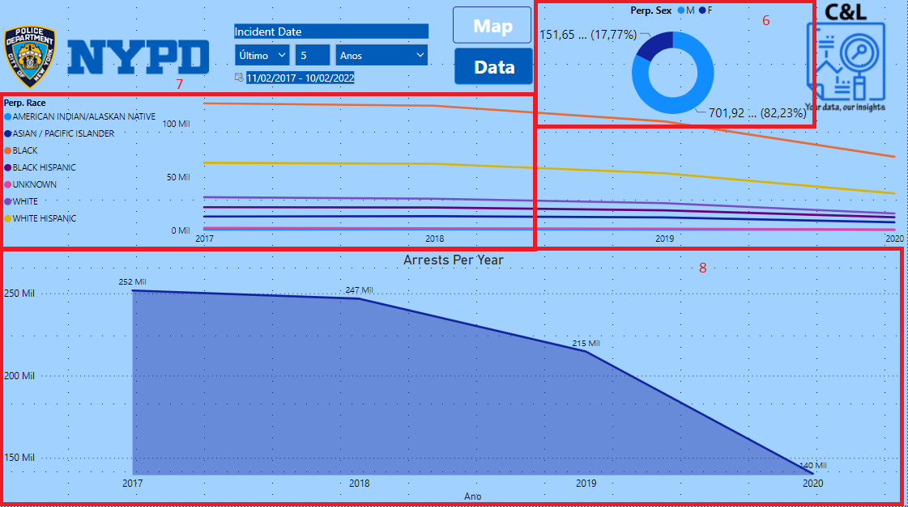

# NYC ARRESTS

This dashboard was created based on arrests made by the NYPD and its main goal is to show how this type of data can be structured and analyzed.

The information in this report was extracted from the [NYPD Stats](https://www1.nyc.gov/site/nypd/stats/crime-statistics/citywide-crime-stats.page), this portal is publicly accessible and available to all who want to access its information.

It is worth remembering that none of the information on this dashboard is private or confidential.

The dashboard was built with two pages. On the Map page, we have a data slicer that serves as a filter for the report and it's presented on both pages (1), we have buttons to be able to navigate between the two pages (2), we have a pie chart which that presents the percentage of arrests made by age group (3), we have a card thar shows the total number of arrests made (4), we have a map that presents markers which represents the exact location where the arrests were made (5), and on the Data page we have a donut chart that presents the percentage of arrests per sex (6), we have a line graph that shows the number os arrests per Perp. Race by year (7) and another line grap that shows the total arrests mabe by year (8).

