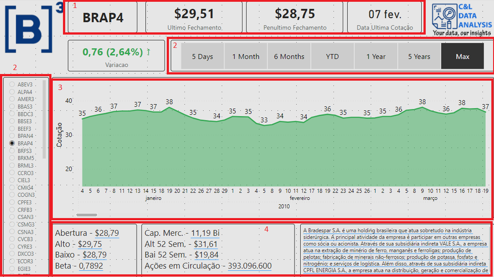
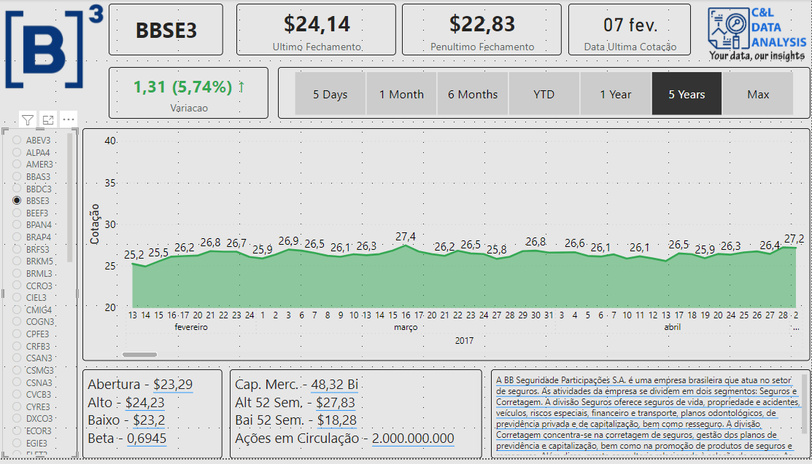
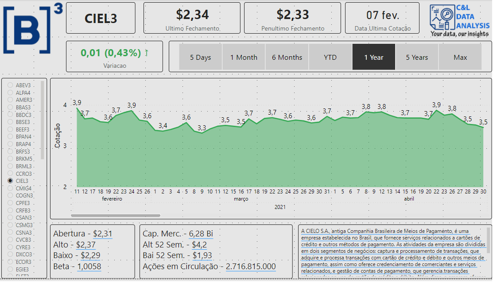
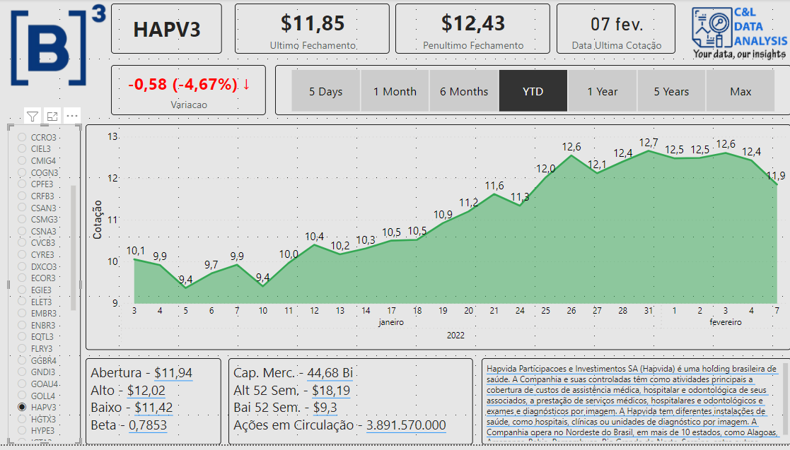

# BRAZILIAN SOTCK MARKET

This dashboard was created based on a Excel fille with all the companies that are listed on the Brazilian Stock Exchange, B3, and its main goal is to show how this type of data can be structured and analyzed.

The information in this report was extracted using an Excel functionality called [Data Types](https://support.microsoft.com/en-us/office/excel-data-types-stocks-and-geography-61a33056-9935-484f-8ac8-f1a89e210877) and all of its information is publicly accessible and available to everyone who wants to access its information.

It is worth remembering that none of the information on this dashboard is private or confidential.

The dashboard was built with a series of cards that shows the value of the last and second to las closings and the company initials (1), we have a data slicer that serves as a filter for the report (2), we have a line graph that presents the a series of values for the stocks (3), and also some text boxes with a series of information about the company (4).

