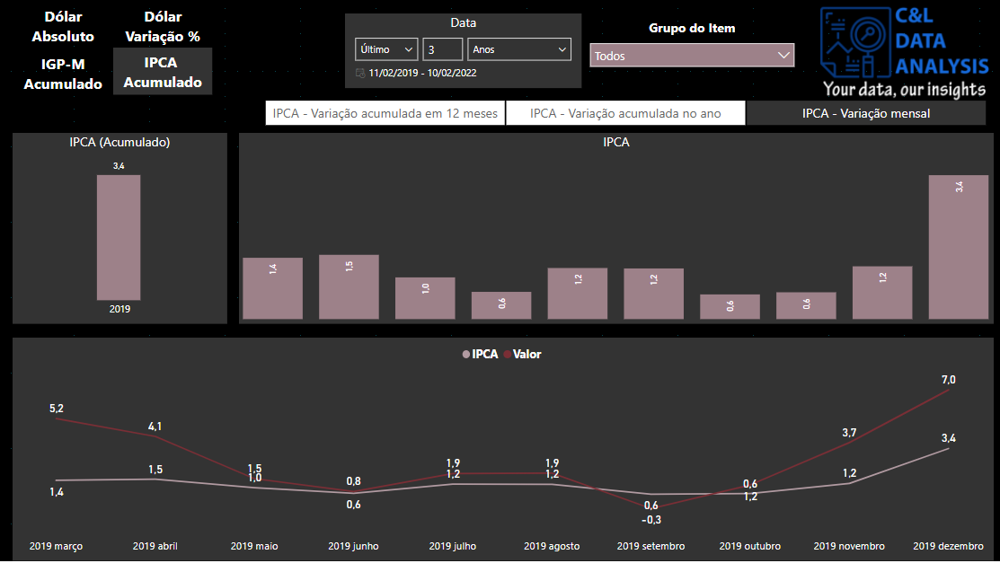

# FINANCIAL MARKET

This dashboard was created based on information about the dollar exchange rate and its variation and also on the IGP-M and IPCA rates and its main goal is to show how this type of data can be structured and analyzed.

For dollar information, the info comes from a [json document](https://www.bcb.gov.br/estabilidadefinanceira/historicocotacoes) provided by the Central Bank of Brazil - BCB.

For Selic information, it comes from a [web connection](https://www.bcb.gov.br/controleinflacao/historicotaxasjuros) from the BCB.

For IGPM info, it comes from a [json document](https://api.bcb.gov.br/dados/serie/bcdata.sgs.4175/dados?formato=json) provided by BCB.

And for IPCA info, it comes from a [API connection](https://apisidra.ibge.gov.br/values/t/1419/n1/all/v/all/p/all/c315/7169,7170,7445,7486,7558,7625,7660,7712,7766,7786/d/v63%202,v66%204,v69%202,v2265%202?formato=json)

All of its information is publicly accessible and available to everyone who wants to access its information.

It is worth remembering that none of the information on this dashboard is private or confidential.

The dashboard was built in four pages, among all pages we have a data slicer that serves as a filter for the report and it appears in all pages (1), we have some buttons that allows us to navigate between pages (2), we have a few cards that show information about the dollar rate (3) and also a series of bar charts and line graps that represente the variation of the dollar, IGPM and IPCA rates (4).

