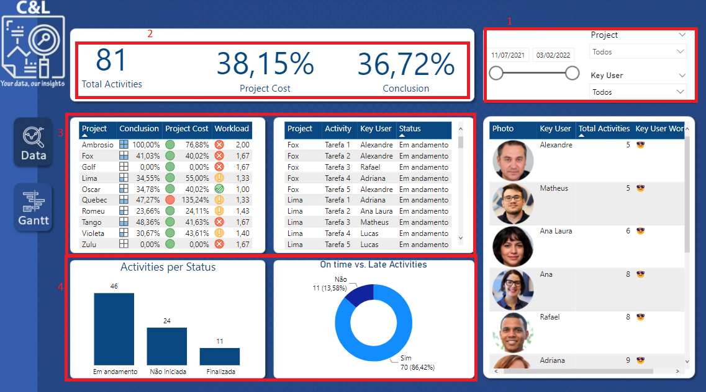
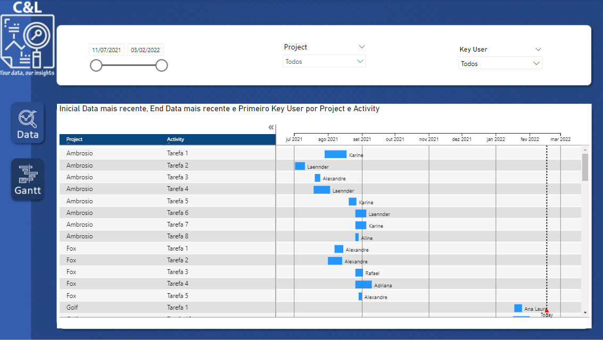

# PROJECTS DASHBOARD

This dashboard was created based on an Excel file with fictitious information about a series of projects and its main goal is to show how this type of data can be structured and analyzed.

It is worth remembering that none of the information on this dashboard is private or confidential.

The dashboard was built in two pages, among them pages we have a data slicer that serves as a filter for the report and it appears in all pages (1), we have a few cards that show the total activites, percentage of project cost and conclusion (2), we also have tables showing information about each project (3) and also a bar chart and a donut chart showing percetages of on time and late activities and also activities per status (4) and on the second page we have a Gantt chart (5), which is not a default chart that comes wih the Microsoft Power BI, it as imported to the system and works really well.

