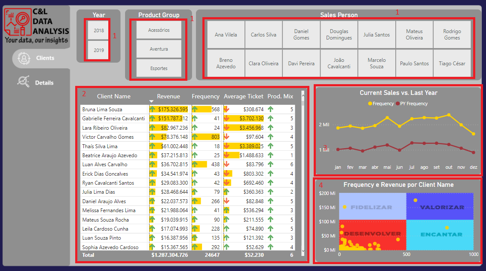

# CLIENTS DASHBOARD

This dashboard was created based on an Excel file with fictitious information about clients data and its main goal is to show how this type of data can be structured and analyzed.

It is worth remembering that none of the information on this dashboard is private or confidential.

The dashboard was built in two pages, among them we have a data slicer that serves as a filter for the report (1), on the Clients page we have a table with information about revenue, frequency, average ticket and mix of products per client (2), a line graph comparing the current sales vs. last year sales (3), a scatter plot comparing information of frequency and revenue per client (4) and on the Details page we have a table with all information about the clients (5).

