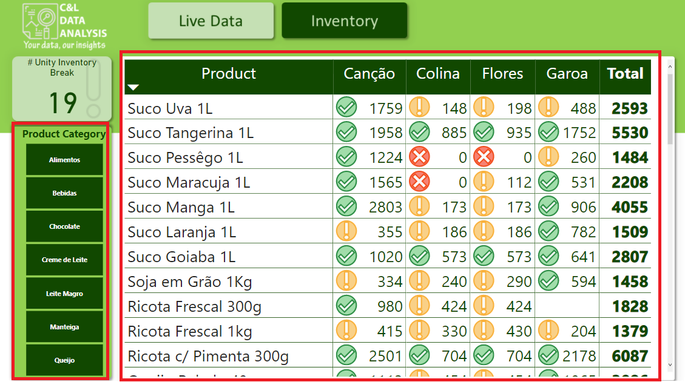

# INVENTORY DASHBOARD

This dashboard was created based on an Excel file with fictitious information about inventory data and its main goal is to show how this type of data can be structured and analyzed.

It is worth remembering that none of the information on this dashboard is private or confidential.

The dashboard was built in two pages, on the Live Data Page we have a data slicer that serves as a filter for the report (1), we have a series of cards that show information about number of inventory itens, inventory turnover, % of inventory break, and total inventory in R$ (2), a line graph showing the inventory turnover (3), a bar chart about inventory turnover per product (4), a bar chart about the Average Cost in R$ per order per month (5), and a table listing all current product listed as inventory break (6) and on the Inventory page we have a table with information about all products (7).

