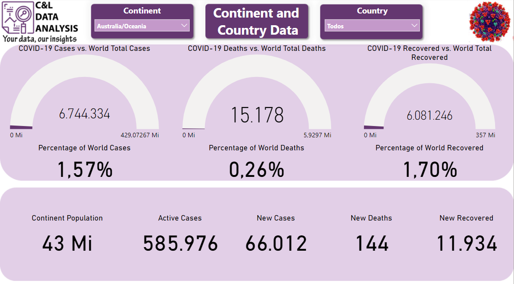
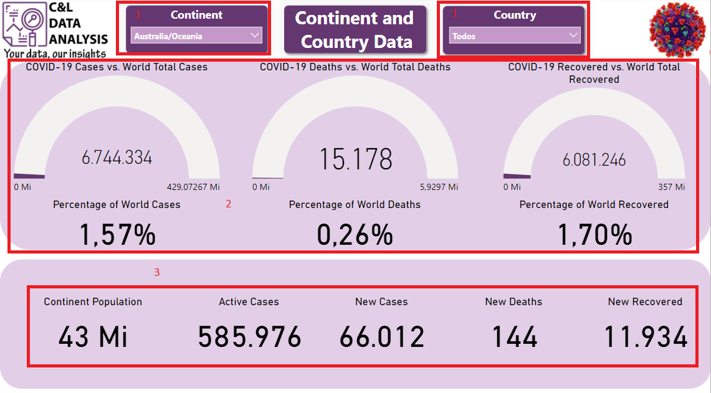
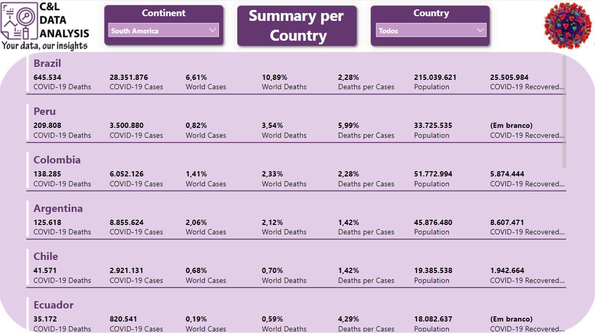
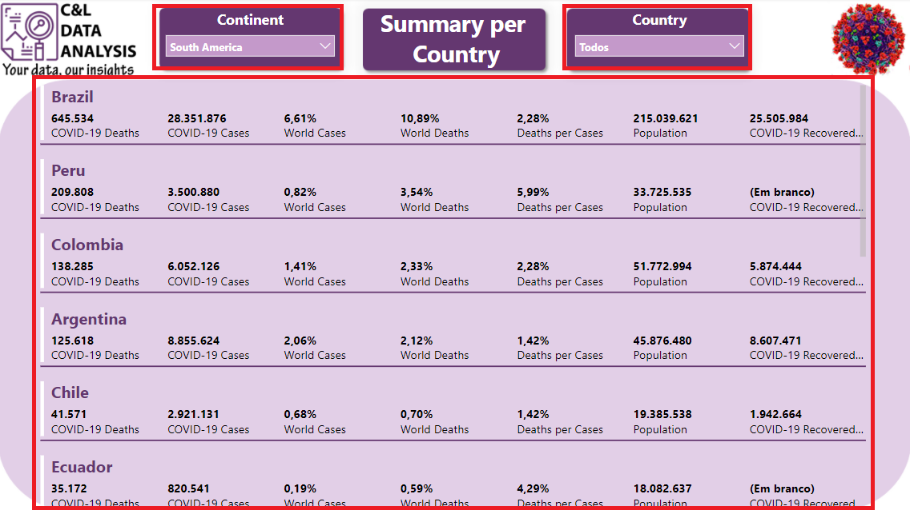

# COVID-19 DASHBOARD

This dashboard was created based on the numbers of the COVID-19 pandemic and its main goal is to show how this type of data can be structured and analyzed.

The information in this report was extracted from the [COVID-19 Visualizer](https://www.covidvisualizer.com/) website, this portal is publicly accessible and available to all who want to access its information.

It is worth remembering that none of the information on this dashboard is private or confidential.

The dashboard was built in two pages, on the Continent Data Page we have a data slicer that serves as a filter for the report and it is available on both pages (1), we have a series of gauge charts that shows a comparison between the world numbers and the numbers related to the continent that was selected on the data slicer (2), and a series of cards with specific information about the continent (3), on the Summary Page we have a multiple line card with detailed information by country (4).

