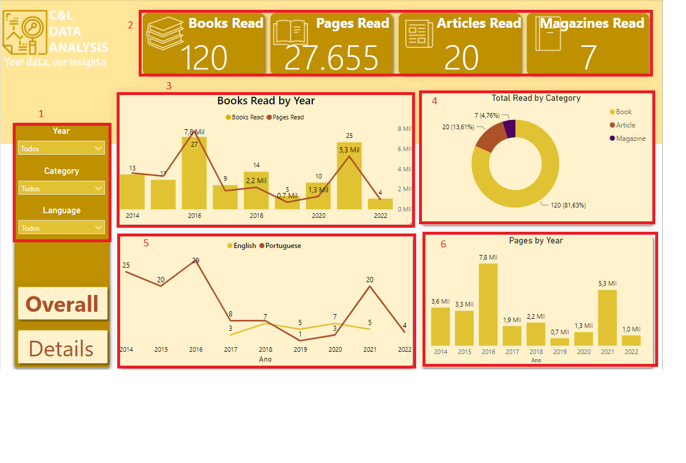

# BOOKS READ DASHBOARD

This dashboard was created based on an Excel file with my own personal information about the books I've read since 2014 and its main goal is to show how this type of data can be structured and analyzed.

It is worth remembering that none of the information on this dashboard is private or confidential.

The dashboard was built in two pages, on the Overall Page we have a data slicer that serves as a filter for the report and it is displayed in both pages (1), we have a series of cards that show information about number of books, pages, articles and magazines read (2), a bar line graph showing the quantity of books and pages read by year (3), donut chart showing the total read by category (4), a line graph showing books read by year and by language (5), and a bar chart with the number of pages read by year (6) and on the Details page we have a couple of cards showing the book that I'm currently reading (7), a table with information about each book, including the number of pages and the rating I've given to each of them (8), a card that shows the description of the book when you select one from the table (9) and a donut chart showing the number of books by rating (10).

