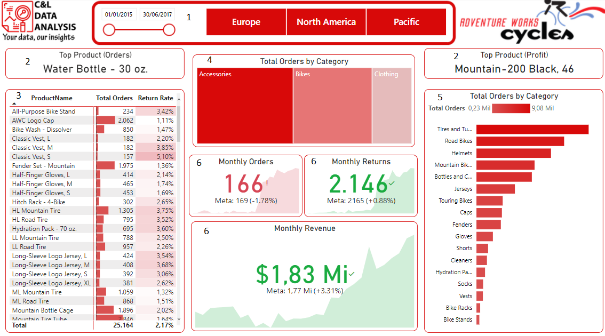
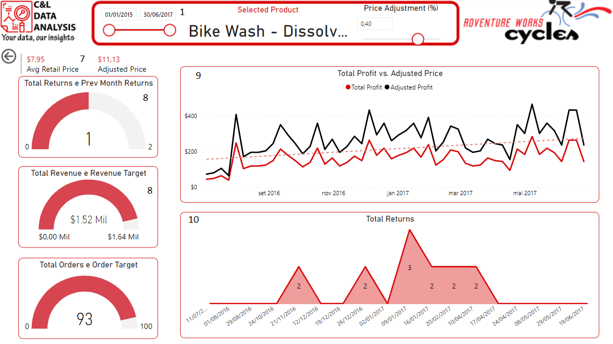
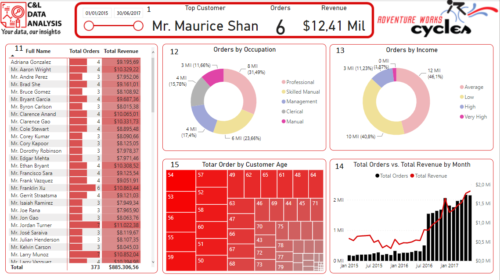

# ADVENTURE WORKS DASHBOARD

This dashboard was created based on an Excel file with fictitious information about store sales and its main goal is to show how this type of data can be structured and analyzed.

It is worth remembering that none of the information on this dashboard is private or confidential.

The dashboard was built in three pages, on the Exec Summary Page we have a data slicer that serves as a filter for the report (1), we have card that shows the product with more orders (2), a table with information about the products (3), a tree map that shows the number of orders by Category (4), a bar chart with total orders by category (5), a few KPIs that shows monthly orders, monthly returns and monthly revenue compared with the previous month (6). 

On the Product Detail page a multiple line card with information about the average retail price and adjusted price (7), a few gauge charts with information about total returns, total revenue and total orders compared with a baseline target (8), a line graph comparing the total profit with the adjusted price (9), another line graph with information abour returns (10).

On the Customer Detail page we have a table with customer information (11), a donut chart about orders by occupation (12), another donut chart with information about orders by income (13), a bar and line chart with information about total orders vs. total revenue by month (14) and a tree map with information about total orders by customer age (15).

