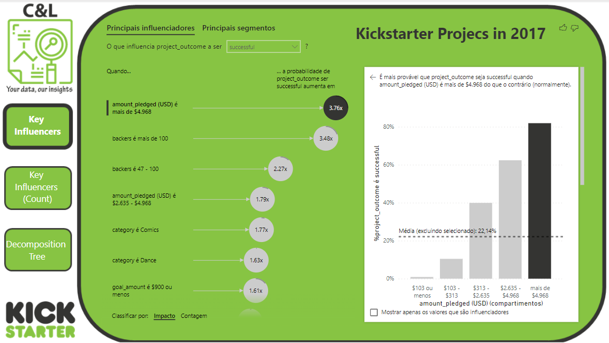
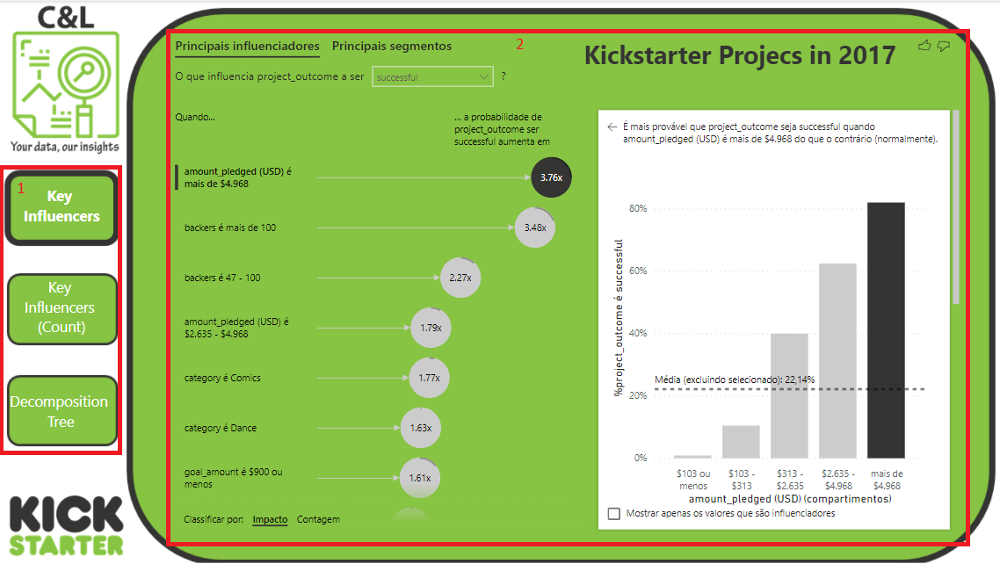
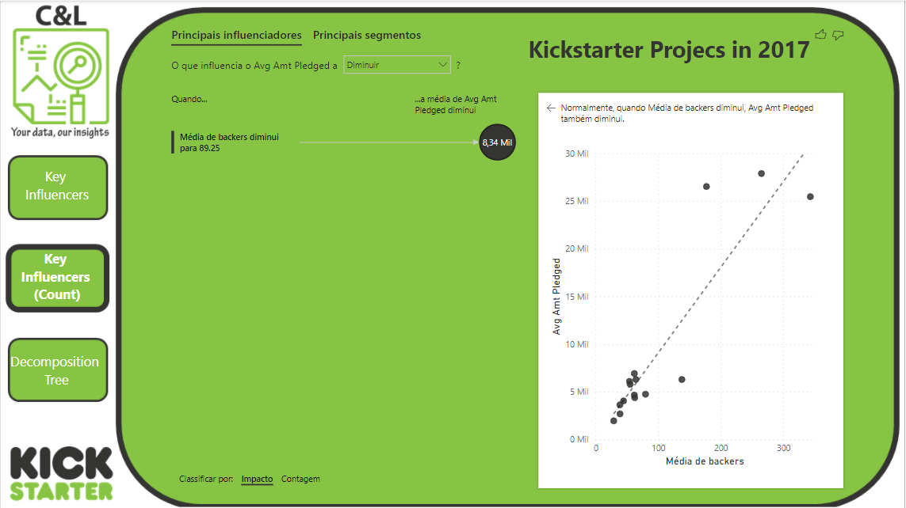

# AI VISUALS

This dashboard was created based on an Excel file with information about projects that were uploaded to the Kickstarter website and its main goal is to show how to use Power BI AI Visuals.

It is worth remembering that none of the information on this dashboard is private or confidential.

The dashboard was built in three pages, on the Key Influencers Page we have a few buttons that allow us to navigate between pages (1), and we have a Key Influencers chart that shows, based on the information we have in our database which aspects influenced the most the projects to succeed (2). 

On the Key Influencers (cont) page we have anoter Key Influencers chart that shows which aspects influenced the most the projects to reach they amount pledged (3).

On the Decomposition Tree page we have a decomposition tree graph that breaks down all the projects by their category, subcategory, project name and backers and which oners were more successful(4).

