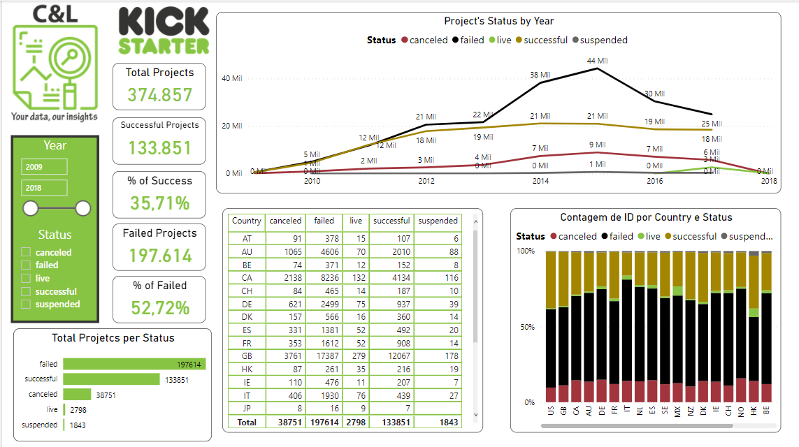
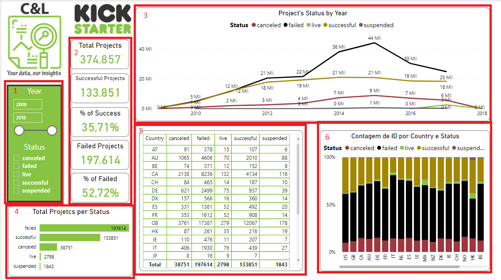

# AI VISUALS

This dashboard was created based on an Excel file with information about projects that were uploaded to the Kickstarter website and its main goal is to show how this type of data can be structured and analyzed.

It is worth remembering that none of the information on this dashboard is private or confidential.

The dashboard was built with a data slicer that serves as a filter for the report (1), we have a few cards that shows information about all the projects, (2), we have a line graph that presents the number of projects per Status by year (3), a bar chart with the total number of projects by Status (4), a table with information about all the projects by country (5), and a column chart that shows the percentage of projects by Status per Country (6).

