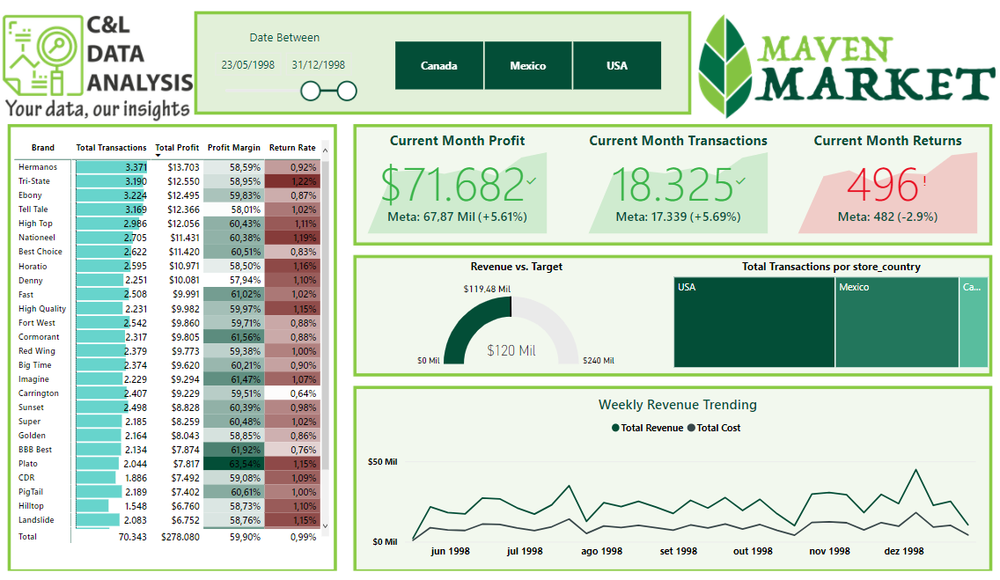
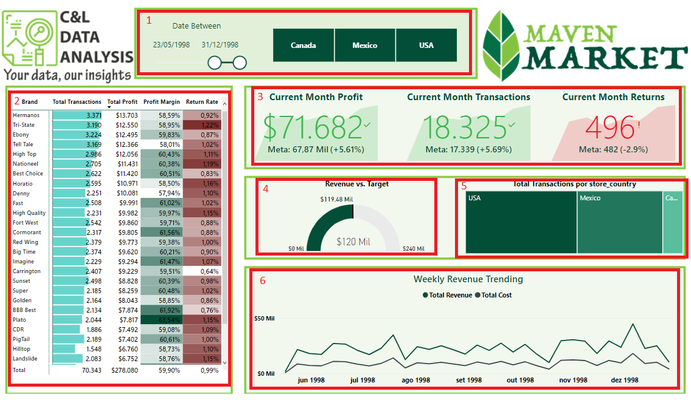

# MAVEN MARKET DASHBOARD

This dashboard was created based on an Excel file with fictitious information about store sales and its main goal is to show how this type of data can be structured and analyzed.

It is worth remembering that none of the information on this dashboard is private or confidential.

The dashboard was built with a data slicer that serves as a filter for the report (1), a table that shows information about the products (2), a few KPIs with information about Current Month Profit, transactions and returns, all compared with previous month (3), a gauge chart with Revenue information(4), a treemap graph with information about transactions per store (5), and a line graph comparing total revenue and total cost (6). 

