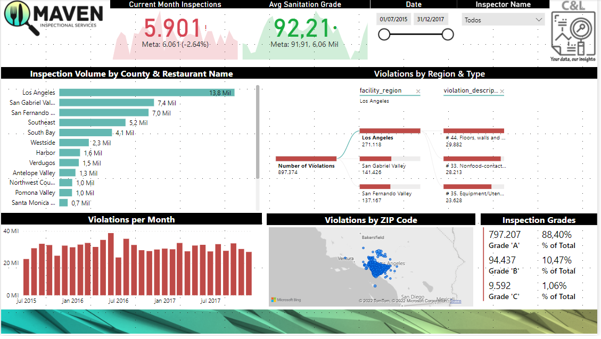
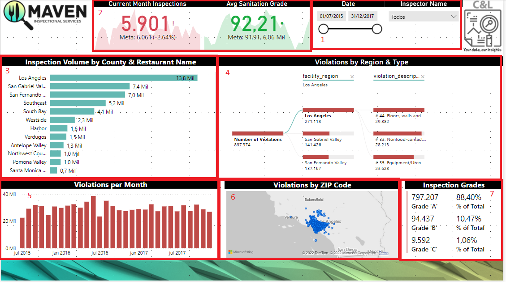

# MAVEN INSPECTIONAL SERVICES DASHBOARD

This dashboard was created based on an Excel file with fictitious information about inspectional services and its main goal is to show how this type of data can be structured and analyzed.

It is worth remembering that none of the information on this dashboard is private or confidential.

The dashboard was built with a data slicer that serves as a filter for the report (1), a couple of KPIs with information about current month inspections and sanitation grage compared with previous month (2), a column chart with information about inspections by region (3), a decomposition tree with information about the violations by region and type(4), a bar chart with information about violations per month (5), a map that presents markers which represents the exact location where the inspections were made (6), and a multiline card with information about the grades (7). 

