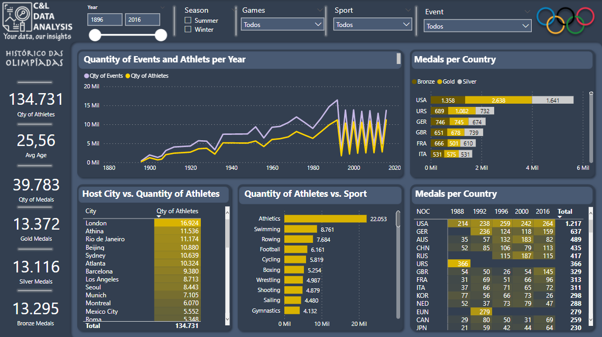
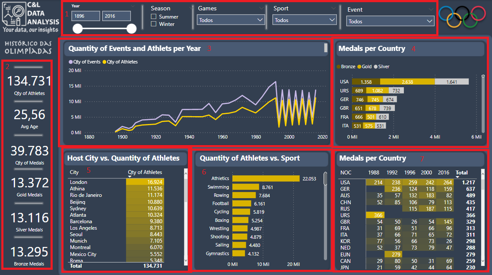
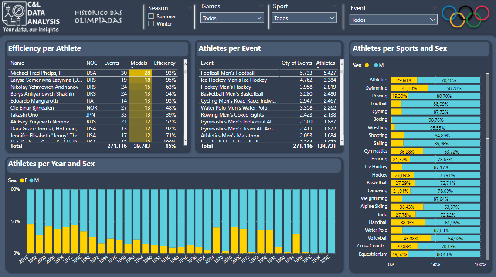
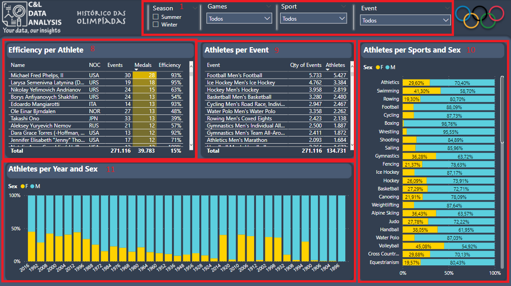

# THE HISTORY OF THE OLYMPIC GAMES DASHBOARD

This dashboard was created based on information about all Olympic Games data, both summer and winter games and its main goal is to show how this type of data can be structured and analyzed.

The information in this report was extracted from the [Olympic history data: thorough analysis](https://www.kaggle.com/heesoo37/olympic-history-data-a-thorough-analysis/data), this portal is publicly accessible and available to all who want to access its information.

It is worth remembering that none of the information on this dashboard is private or confidential.

The dashboard was built with two pages, on the History page we have a few data slicers that serves as a filter for the report and are present in both pages (1), a few cards with information about quantity of athletes, average age, quantity of medals and so on (2), a line graph comparing the quantity of events and athletes in each edition of the games (3), a bar chart with information about the quantity of medals won by country (4), a table showing the number of athletes that participated in each edition of the games (5), a bar chart with information about the quantity of athletes per sport (6), and a table with information about the quantity of medals per country per edition (7).

On the Athlete Breakdown page we have a table comparing the quantity of events and medals won by each athlete (8), a table with information about the quantity of events and athletes per modality (9), a bar chart with comparing the percentage of male and female athletes per sport (10), and a column chart comparing the percentage of male and female athletes per edition of the Olympic Games (11). 

