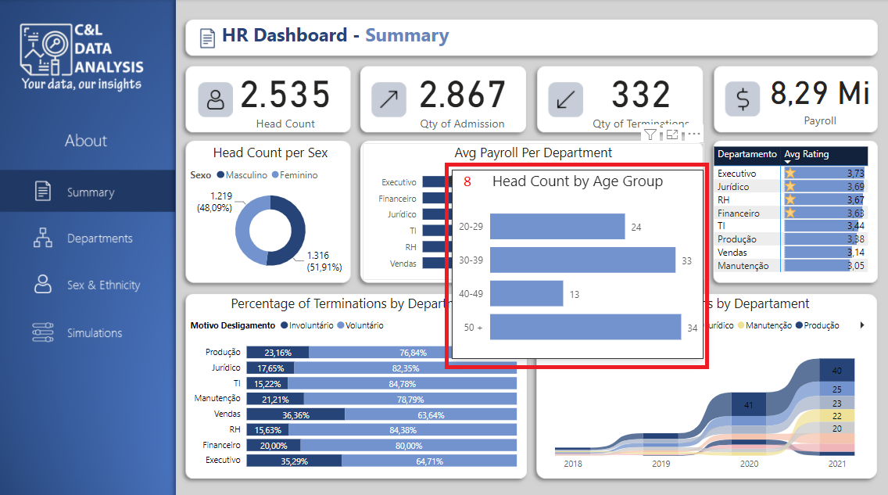

# HUMAN RESOURCES DASHBOARD

This dashboard was created based on an Excel file with fictitious information about human resources data and its main goal is to show how this type of data can be structured and analyzed.

It is worth remembering that none of the information on this dashboard is private or confidential.

The dashboard was built in three pages, on the Summary Page we have a few buttons that allow us to navigate between the dashboard pages, those buttons appear in all pages(1), we have a series of cards that show information about the Head Count, quantity of admissions and terminations and the total value of the payroll (2), a donut chart that show us the Head Count per sex (3), a bar chart with information about the average payroll per department (4), a table with information about the average rating of each department (5), a stacked bar chart with the percentage of terminations by department and by motive (6) and a band chart with information of the number of terminations by department by year (7).

As an extra, everytime that the mouse is positioned on top of any department, a small chart appears showing the departmen head count per age group (8), this feature is called 'Tool tip'. On top of that, if we do a right click on top of any department name on any page of the report and go to 'Drill-through' and click on 'Employees', we are redirected to anoter page with a table containing detailed information about all the employees from that specific Department (9 and 10).

On the Departments page, we have a data slicer that works as a filter for the whole report and it appears in almost all the pages (11), we have a bar chart with information about the payroll value per department (12), a bar chart with information about the head count per age group (13), a multiline card with information about the head count, payroll, average payroll, average rating and average absence (14), a bar chart with information about the average payroll per department (15) and a line graph with information about the head count by date (16).

And, on the Sex & Ethnicity page we have a scatter plot comparing the average payroll and the average rating (18), a stacked bar chart with information about the average absence (19), a stacked bar chart with information about the average payroll (20) all of them separeted per ethnicity and per sex and a multiline card with information about Head count, payroll, average payroll, average rating and average absence per sex (21).

