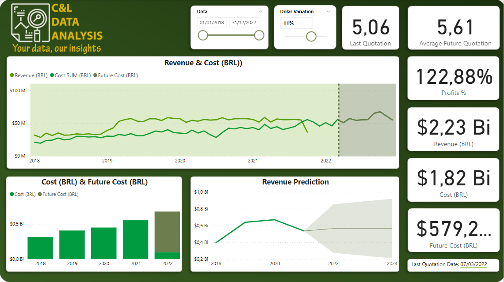
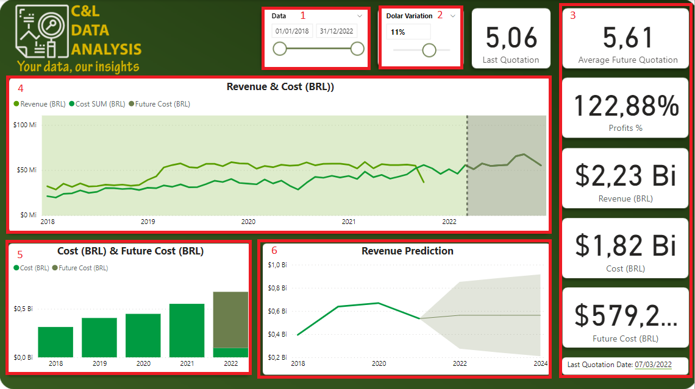

# FINANCIAL PROJECTIONS DASHBOARD

This dashboard was created based on an Excel file with fictitious information about a company's products, costs and revenues data and its main goal is to show how this type of data can be structured and analyzed. On top of the information that is provided, a few features were created so the user is able to see financial projections based on the variation of the dolar price.

It is worth remembering that none of the information on this dashboard is private or confidential.

The dashboard was built with a data slicer that serves as a filter for the report (1), we have a parameter called 'Dolar Variation' which is a feature used to simulate a percentage in the variation of the dolar quotation, this feature is the responsible for the changes in future prices of the dolar and the changes in all the cards and charts in the report (2), a few cards with information abou the future quotation of the dolar, percentage of profits, revenue, costs and future costs, all in BRL(3), a line graph with information about the cost, revenue and future cost, which is controlled by the parameter that was created (4), a column chart with the current costs and future costs (5), and a line graph with revenue and a prediction of furute revenue (6).

