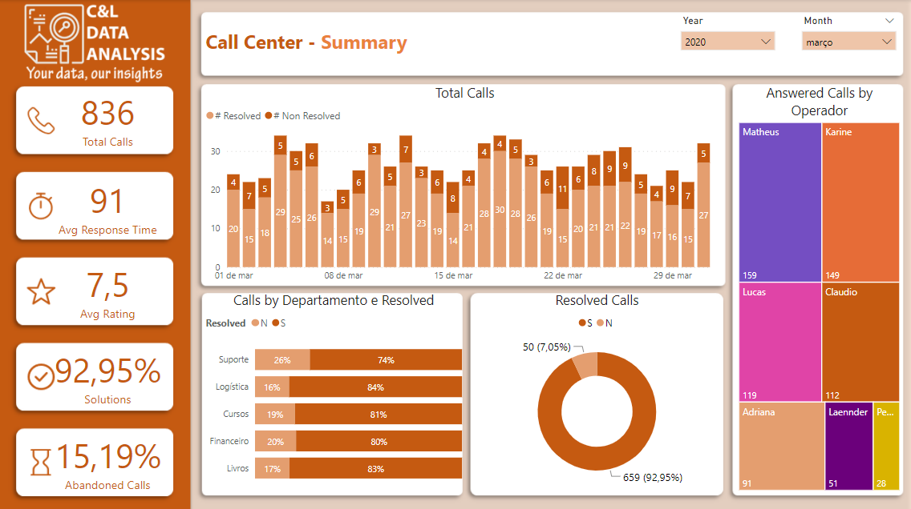
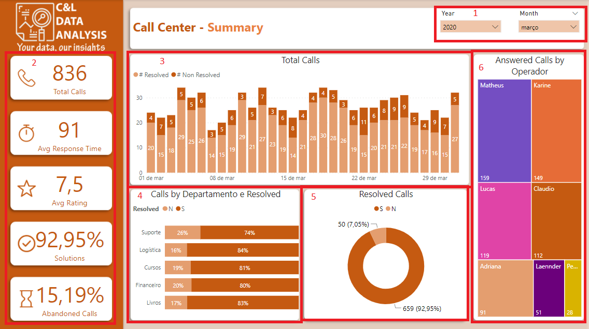
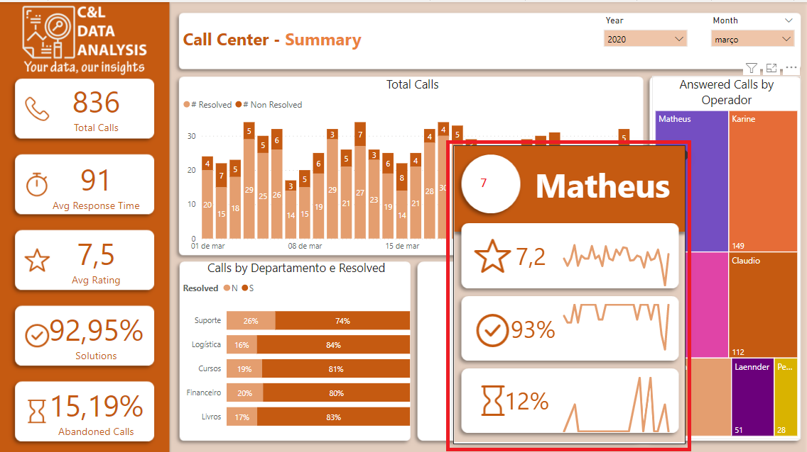

# CALL CENTER DASHBOARD

This dashboard was created based on an Excel file with fictitious information about a Call Center operation and its main goal is to show how this type of data can be structured and analyzed. 

It is worth remembering that none of the information on this dashboard is private or confidential.

The dashboard was built with two data slicers that serves as a filter for the report (1), we have a series of cards with information about total calls received, everage response time (in seconds), everage rating, percentage of solutions and percentage of abandoned calls (2), a stacked column chart with information about the number os resolved and non-resolved calls by day (3), a stacked bar chart with the percentage of resolved and non-resolved calls by department (4), a donut chart with the percentage of resolved and non-resolved calls (5), a treemap with the number of answered calls by operator (6), and when we position the mouse on top of one of those operators we have a tolltip that shows the KPI's for that specific operator (7).

