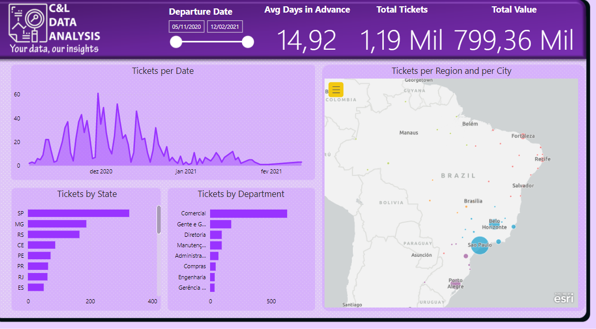

# TRIPS DASHBOARD

This dashboard was created based on an Excel file with fictitious information about a Company's trips record and its main goal is to show how this type of data can be structured and analyzed. 

It is worth remembering that none of the information on this dashboard is private or confidential.

The dashboard was built with a data slicer that serves as a filter for the report (1), we have a series of cards with information about the number of total tickes, their total value and the average number of days in advance that they were bought  (2), a line chart with information about the number os tickets per day (3), a bar chart with information about the number of tickets per state (4), a bar chart with information about the number of tickets per department (5), a map with visual data about the region and city of destination of each ticket bought (6), and when we position the mouse on top of one of those operators we have a tolltip that shows the a bar chart with information about the number of tickets per motive and the average number of days in advance that they were bought (7).

