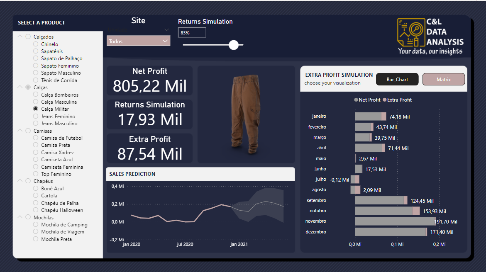
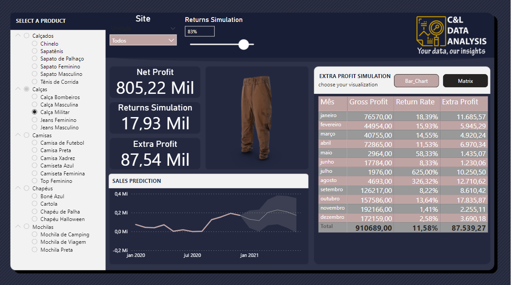
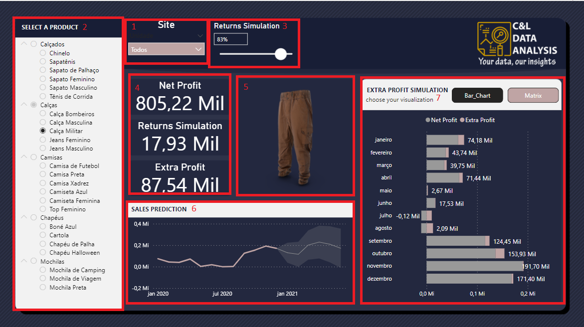

# PRODUCTS DASHBOARD

This dashboard was created based on an Excel file with fictitious information about a Sales and Products records and its main goal is to show how this type of data can be structured and analyzed. 

It is worth remembering that none of the information on this dashboard is private or confidential.

The dashboard was built with a data slicer that serves as a Site filter for the report (1), another data slicer with information about the category and products  (2), we have a parameter called 'Returns Simulation' which is a feature used to simulate a percentage in the variation of the returns rate, this feature is responsible for the changes in the value of the extra profit (3), a few cards with information about Net Profit, Returns and Extra Profit (4), a visualization called 'Simple Image' that was imported into the system and it shows the image of each product selected (5), a line chart with information about sales values and the predicted values (6), and we have a couple buttons that are able to switch between a bar chart that contains information on Net Profit and Extra Profit and a Matrix with information on Gross Profit, Return Rate and Extra Profit by Month (7).

