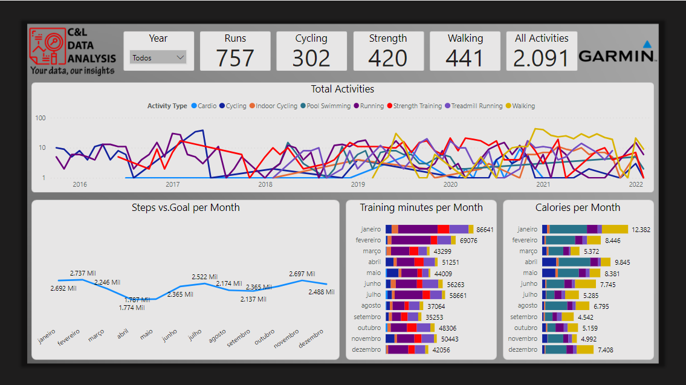
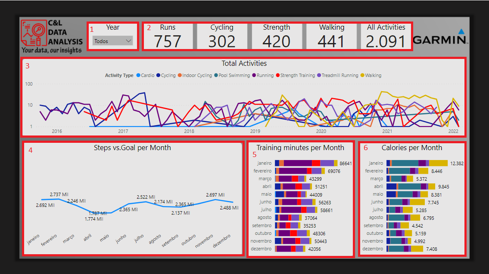
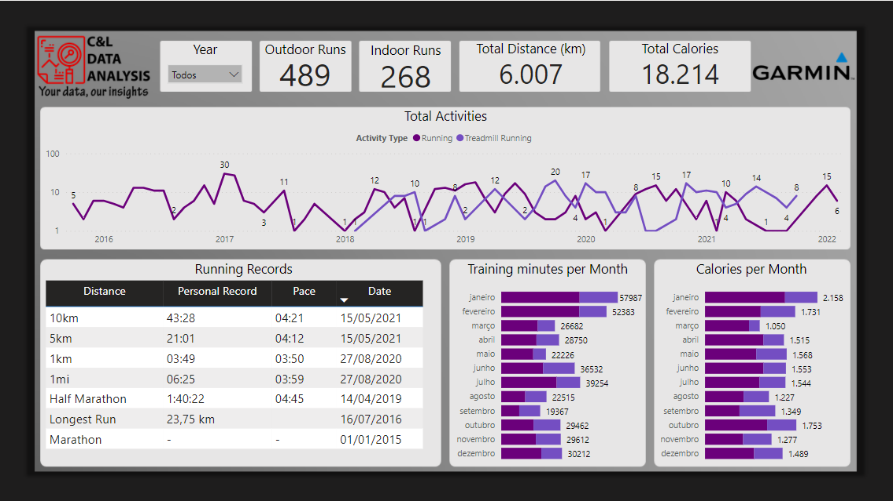
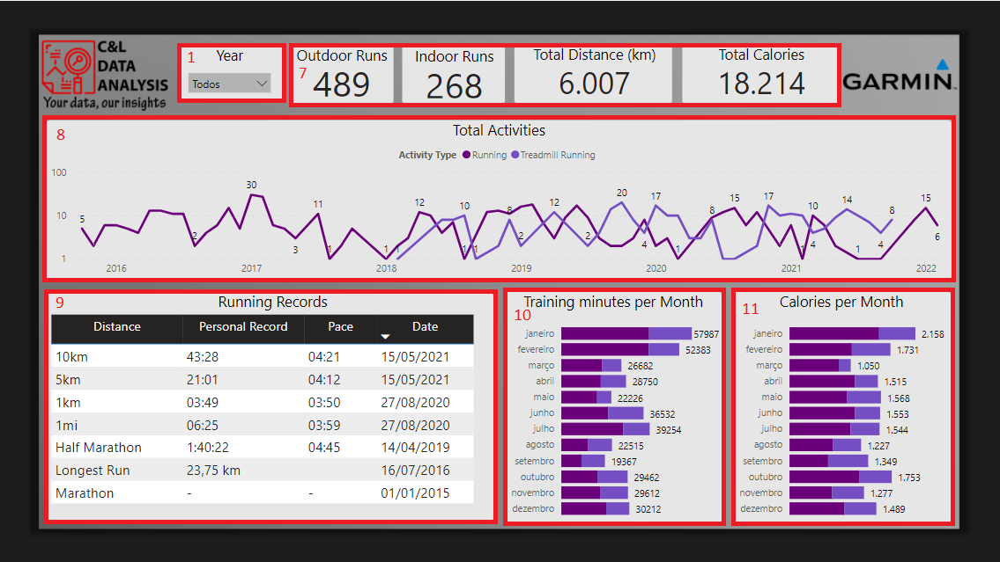
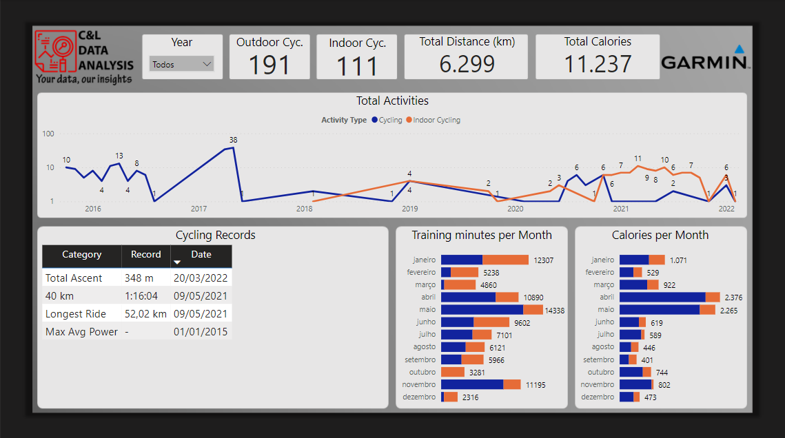
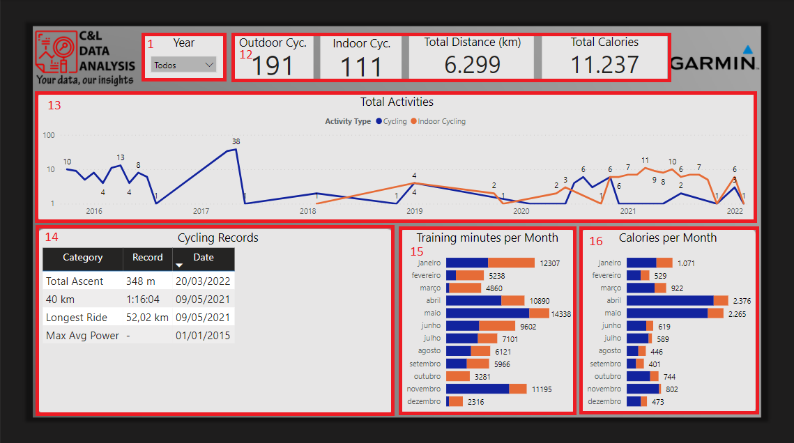
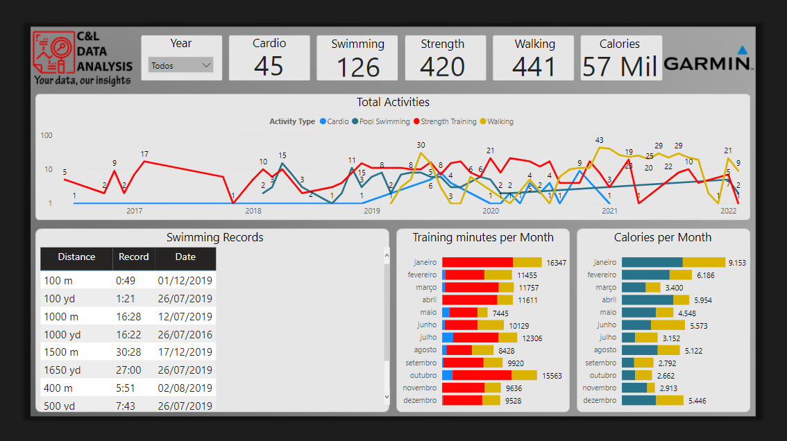
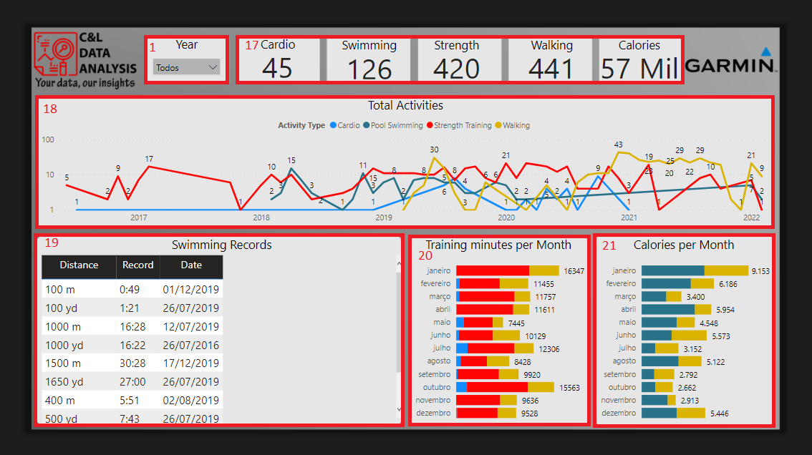

# GARMIN ACTIVITIES DASHBOARD

This dashboard was created based on a few Excel files with information about my training activities that were registered with my Garmin gadgets.

It is worth remembering that none of the information on this dashboard is private or confidential.

The dashboard was built in four pages. On the General Activities page we have a data slicer that serves as a Year filter for the report and it appears in all pages(1), a few cards with information about the number of total runs, cycling, strength and walking activities (2), we have a line graph comparing the number of activities by year, quarter and month (3), a line graph with information about the total steps per month (4), a stacked bar chart with information about the Training Minutes per month (5), another stacked bar chart with infomation about the total Calories per month (6).

On the Running page, we have a few cards with information about Outdoor and Indoor runs, total distance and total calories (7), a line graph comparing the number of activities by year, quarter and month (8), a table with information about my running records (9), a stacked bar chart with information about the Training Minutes per month (10), another stacked bar chart with infomation about the total Calories per month (11).

On the Cycling page, we have a few cards with information about Outdoor and Indoor cycling, total distance and total calories (12), a line graph comparing the number of activities by year, quarter and month (13), a table with information about my cycling records (14), a stacked bar chart with information about the Training Minutes per month (15), another stacked bar chart with infomation about the total Calories per month (16).

On the Other Activities page, we have a few cards with information about total Cardio, Swimming, Strangth and Walking activities and Total Calories (17), a line graph comparing the number of activities by year, quarter and month (18), a table with information about my swimming records (19), a stacked bar chart with information about the Training Minutes per month (20), another stacked bar chart with infomation about the total Calories per month (21).

