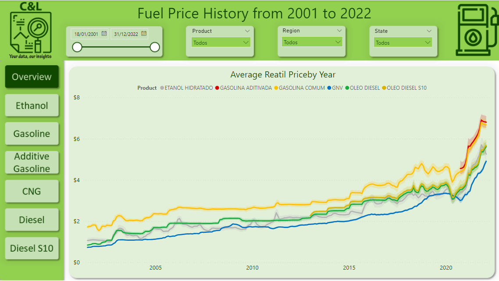
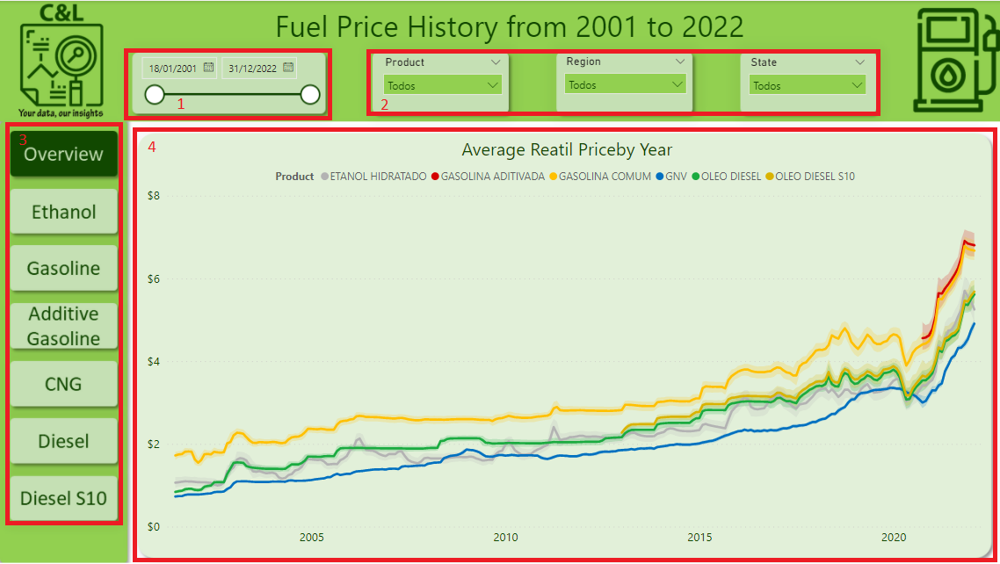
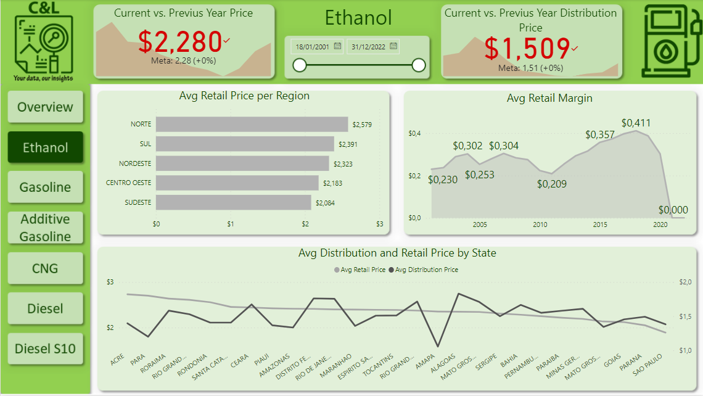
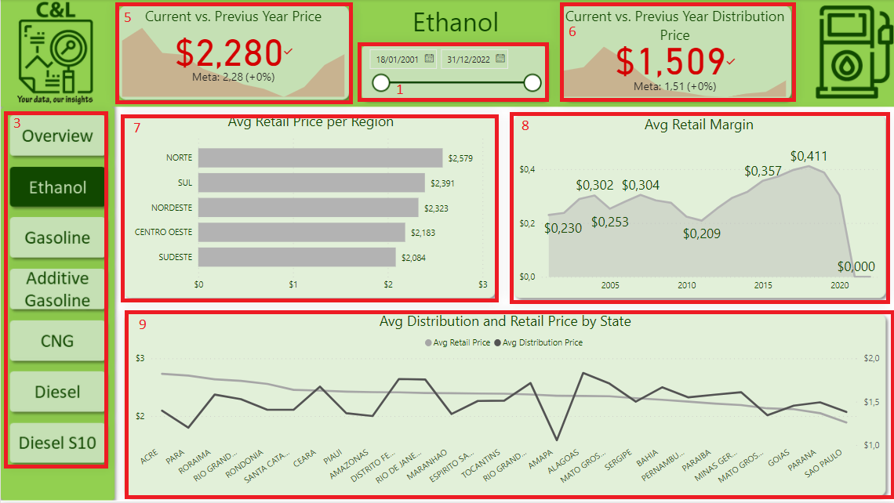
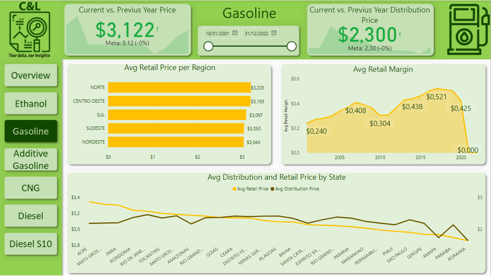
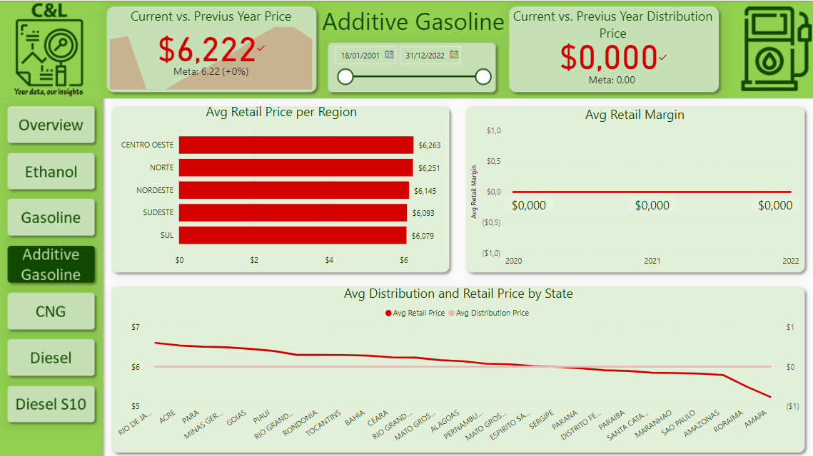
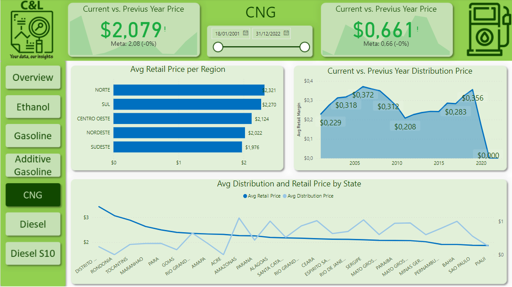
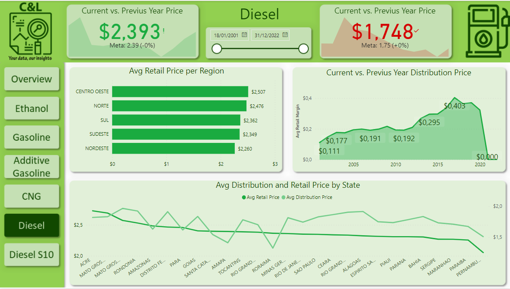
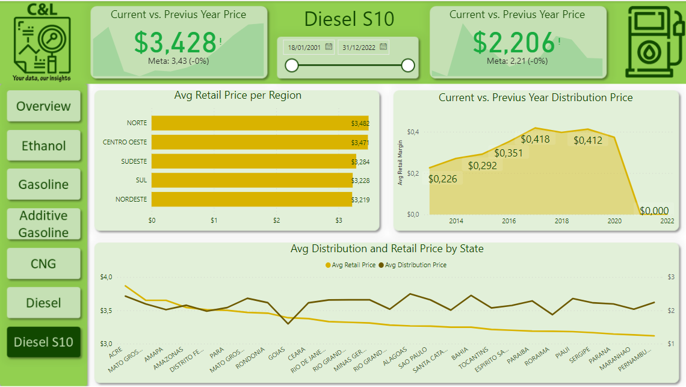

# FUEL PRICES

This dashboard was created based on a Excel file that was extracted from the [Agência Nacional do Petróleo](www.gov.br/anp) website with information about the price history of several kinds of vehicles fuels from 2001 to 2022.

It is worth remembering that none of the information on this dashboard is private or confidential.

The dashboard was built in seven pages. On the Overview page we have a data slicer that serves as a Date filter for the report and it appears in all pages (1), a few other data slicers to filter data related to Product - Fuel type, Region and State (2), a few buttons that allow us to access the different pages of the dashboard (3), a line graph comparing the average fuel price by product and by year (4).

On the Ethanol page, we have the same Date filter (1), a KPI comparing the current vs. the previus year retail price (when the price stays the same os goes up it gets red and when the prices goes down it gets green) (5), another KPI comparing the current vs. the previus year distribution price (when the price stays the same os goes up it gets red and when the prices goes down it gets green) (6), a bar chart comparing the average retail price per region (7), a line graph comparing the average retail margin per year (8) and a line graph comparing the average distribution price and retail price by State (9).

On all other pages, the visual are the same, but they are focused on each type of Fuel.

