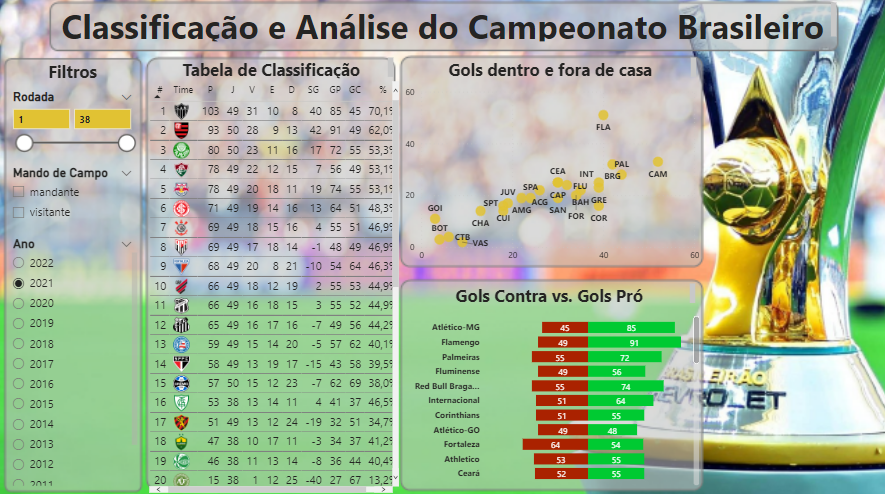
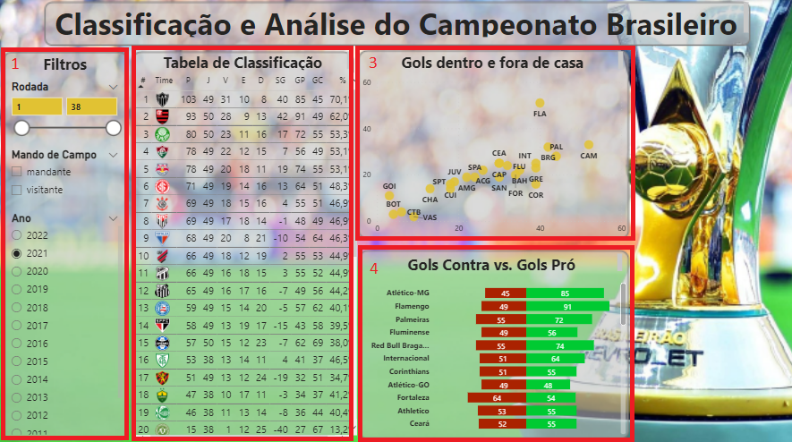

# CAMPEONATO BRASILEIRO

This dashboard was created based on a series os API web  links provided by [DATAB](https://api.databinteligencia.com.br/Brasileirao/) with information about the clubs, matches and results, on those files we have information from 2009 up to 2022 (which will be updated during along the year as soon as each round is done.

It is worth remembering that none of the information on this dashboard is private or confidential.

The dashboard was built with a few data slicers that serves as a Site filter for the report based on they year, home and away matches and each round of games (1), a table with information of the classification, the club, point won, wins, draws, losses and so on (2), a scatter chart with information about goals made on home and away games (3), and a stacked bar chart comparing the number of goals for and goals against (4).

