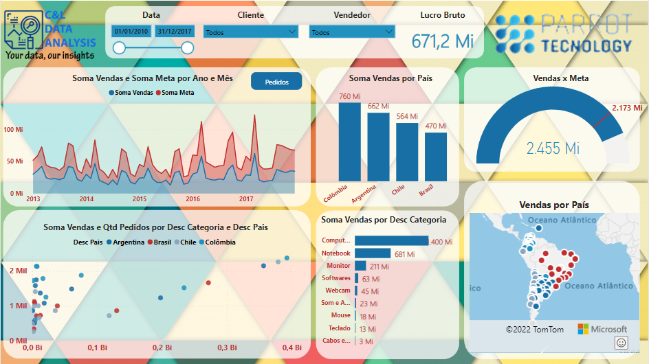
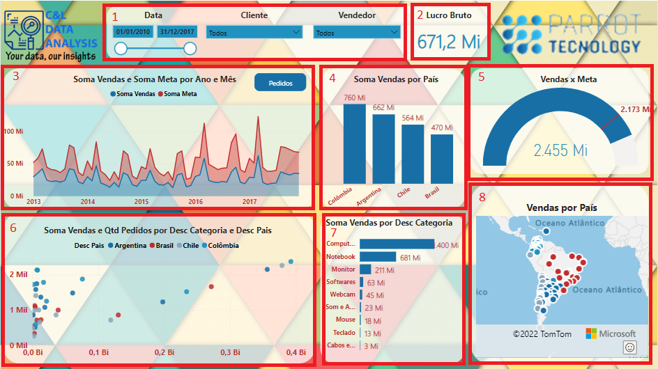
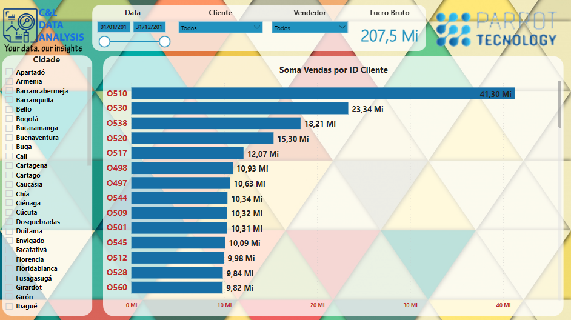
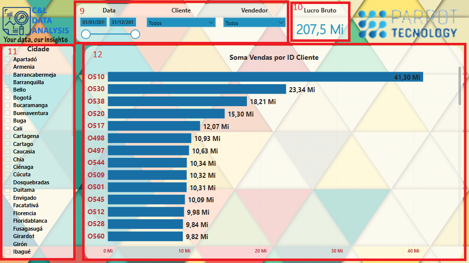
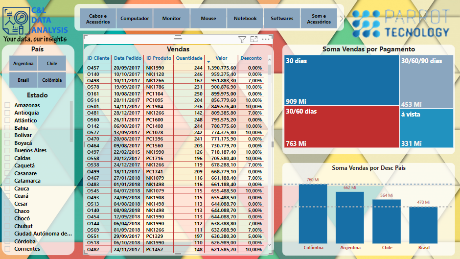
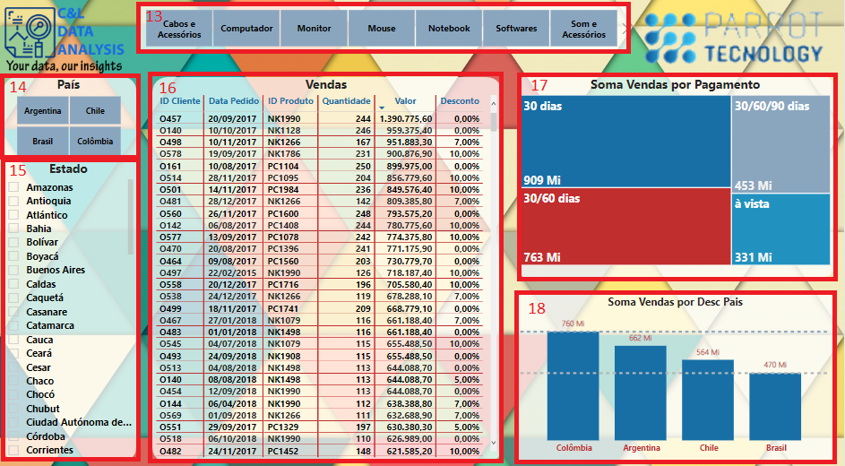
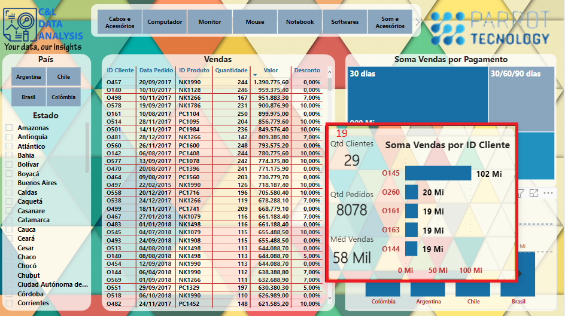

# PARROT TECNOLOGY - FICTITIOUS

This dashboard was created based on the book [Dominando o Power BI 3ª edição](https://www.databinteligencia.com.br/produtos/dominando-o-power-bi/), wrote by Karine Lago and Laennder Alves, founders of [DATAB](https://www.databinteligencia.com.br/) with information about a fictitious company called Parrot Technology regarding their sales and customers.

It is worth remembering that none of the information on this dashboard is confidential.

This dashboard was built with 3 pages. On the Geral page, we have a few data slicers that serves as a filter for the report based on the date, client ID and Seller ID (1), a card with information about gross profit (2), a area graph comparing total sales and target by month (3), a column chart with information about sales per country (4), a speedometer chart with information about sales (5), a scatter plot comparing total sales, orders and category by country (6), a bar chart with information about sales per category (7), and a Azure Map chart with sales per country (8).

On the Clientes page, we have the same slicers from the Geral page (9), a card with gross profit (10), a data slicer with information about the cities (11), and a bar chart with information about total sales per client ID (12).

On the Pedidos page, we have a data slicer with information about the Product Category (13), a data slicer with information about country (14), another data slicer with information about State (15), a table with information about Client ID, Order Date, Product ID, Quantity, Value and Discount (16), a Treemap comparing information about total sales per payment type (17), and a column chart with information about total sales per country with two lines representing the lower and the higher values (18).

And when we position the mouse on top of any of the visuals we have the dashboard, a tolltip apperas and shows cards with information about quantity of clients, quantity of orders and average sales and also a bar chart with information about total sales by client ID (19).

