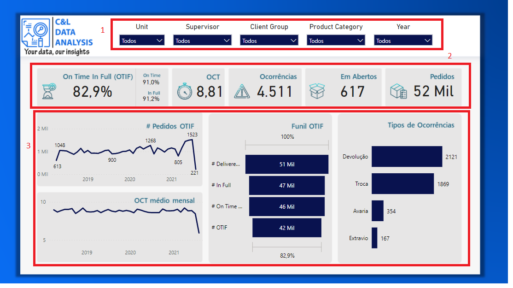
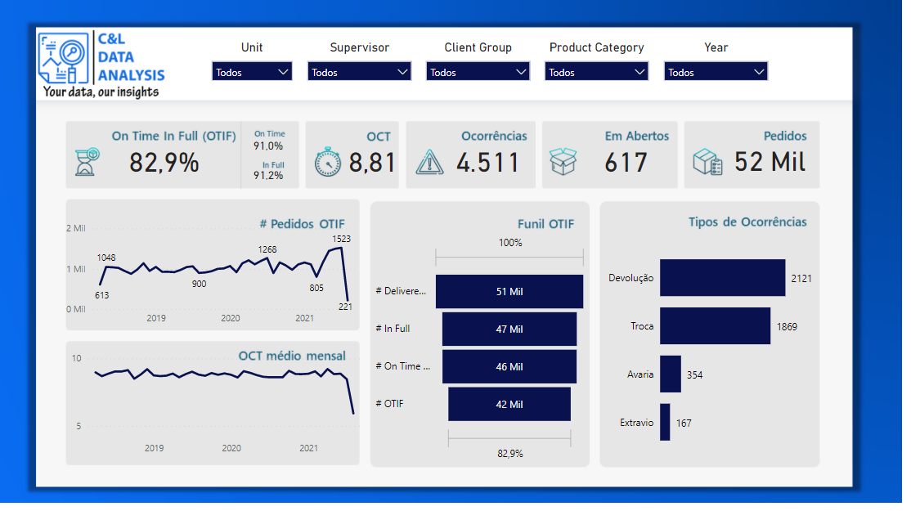

# LOGISTICS DASHBOARD

This dashboard was created based on an Excel file with fictitious information about logistics data and its main goal is to show how this type of data can be structured and analyzed.

It is worth remembering that none of the information on this dashboard is private or confidential.

The dashboard was built using a data slicer that serves as a filter for the report (1), we have a few cards that show the OTIF, OCT, Open orders, Total order and incidents (2), and four different charts, two line charts representing OTIF orders and monthly average OCT, one funil graph showing the OTIF Funil and a bar chart with the types of incidents (3).

